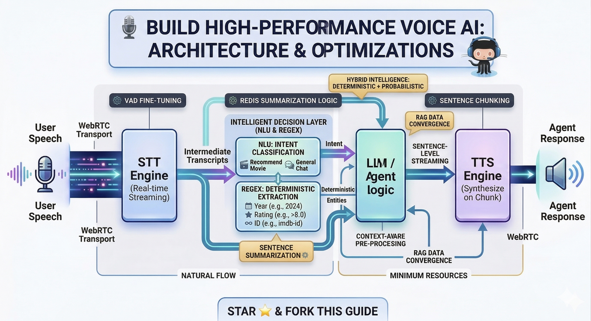

# 🎙️ High-Performance Real-Time Voice AI

### From Turn-Based Pipelines → Continuous Conversational Systems

> This repository documents the architecture, trade-offs, and optimizations behind building a **low-latency, real-time Movie Recommendation Voice Agent** that behaves like a *human conversation*, not a walkie-talkie.



---

## ❌ The Problem: The “Turn-Based” Trap

Most voice systems still follow:

```
STT → LLM → TTS
```

This creates fundamental limitations:

* 🧠 **Context Loss**
  Long-form speech (30–60s) breaks coherence or exceeds buffer limits.

* ⏱️ **Robotic Latency**
  Systems wait for *complete transcripts* → causing dead air.

* 🌐 **Protocol Bottlenecks**
  WebSockets introduce jitter and are not optimized for real-time media.

---

## ⚡ Core Design Principle

> **Never wait. Always stream. Always overlap.**

Human conversation is:

* Parallel (listen + think + speak together)
* Interruptible
* Context-aware in real-time

This system is designed to replicate that.

---

## 🏗️ Architecture Overview

```
User (Speech)
   │
   ▼
WebRTC (Low-latency transport)
   │
   ▼
Streaming STT (Partial transcripts)
   │
   ▼
Redis (Hot Context Layer)
   │
   ├── Background Summarizer (Intent extraction)
   ▼
Streaming LLM (Token generation)
   │
   ▼
Sentence Chunker
   │
   ▼
Streaming TTS
   │
   ▼
User (Audio Playback)
```

---

## 🛠️ Core Optimizations

### 1. 🚀 Transport Layer: WebRTC over WebSockets

**Problem:**
WebSockets = reliable, but not real-time optimized.

**Solution:**
Shifted to **WebRTC (UDP-based streaming)**

**Impact:**

* Reduced jitter
* Sub-second round-trip latency
* True bidirectional audio streaming

---

### 2. 🧠 Streaming Context with Redis (Hot Memory Layer)

**Problem:**
Waiting for final transcripts → context delay + overflow

**Solution:**

* Push **partial STT fragments** into Redis
* Run **background summarization workers**
* Continuously update conversation state

**Impact:**

* LLM is *pre-conditioned* before user finishes speaking
* Eliminates “thinking delay”

---

### 3. 🎧 Intelligent Barge-In (VAD Optimization)

**Problem:**

* Either too sensitive (noise triggers)
* Or too strict (ignores user interruption)

**Solution:**

* Multi-threshold **Voice Activity Detection (VAD)**
* Dynamic sensitivity tuning
* Interrupt-aware playback control

**Impact:**

* Seamless user interruption
* Robust against ambient noise

---

### 4. 🗣️ Sentence-Level Streaming (Parallel Thinking + Speaking)

**Problem:**
Waiting for full LLM output = 3–5s silence

**Solution:**

* Stream tokens → group into **sentence chunks**
* Trigger TTS per sentence

**Flow:**

```
Sentence 1 → TTS starts
Sentence 2 → still generating
Sentence 3 → queued
```

**Impact:**

* Near-zero perceived latency
* Human-like response flow

---

## 📊 Data Flow (Real-Time Execution)

```
Audio (20–50ms chunks)
   ↓
Partial STT
   ↓
Redis (live context update)
   ↓
LLM token stream
   ↓
Sentence segmentation
   ↓
TTS streaming
   ↓
Immediate playback
```

---

## ⏱️ Performance Benchmarks

| Metric               | Result    |
| -------------------- | --------- |
| First audio response | < 500ms   |
| Full-duplex latency  | ~700ms    |
| Barge-in response    | < 200ms   |
| Perceived delay      | Near-zero |

---

## 🧪 Real-World Use Case

🎬 **Movie Recommendation Voice Agent**

* Handles long user preferences (“I like Nolan-style sci-fi…”)
* Responds while user is still forming thoughts
* Supports interruption mid-response

---

## 🧩 System Design Insights

### 🔹 1. Latency is architectural, not computational

Throwing GPUs ≠ solving delay
**Streaming pipelines > raw compute**

---

### 🔹 2. Context must be “alive”

Static prompts fail in voice systems
Use **hot memory layers (Redis)**

---

### 🔹 3. Voice ≠ Chat

Chat = turn-based
Voice = **continuous state machine**

---

## 🚀 Getting Started

```bash
git clone https://github.com/<your-username>/realtime-voice-ai
cd realtime-voice-ai

pip install -r requirements.txt
uvicorn app.main:app --reload
```

---

## 📌 Roadmap

* [ ] Full-duplex WebRTC pipeline
* [ ] Emotion-aware TTS modulation
* [ ] RAG integration for long-term memory
* [ ] Edge deployment (sub-200ms latency target)

---

## 🤝 Contributing

If you're working on:

* VAD tuning
* Real-time RAG
* Streaming inference optimization

Feel free to open an issue or collaborate.

---

## 🧑‍💻 Author

**Naresh Chaudhary**
Building systems at the intersection of **AI × Real-Time Interaction × Human Cognition**

---

## ⭐ Final Thought

> The future of AI is not faster responses.
> It’s **continuous thinking systems that never pause.**
