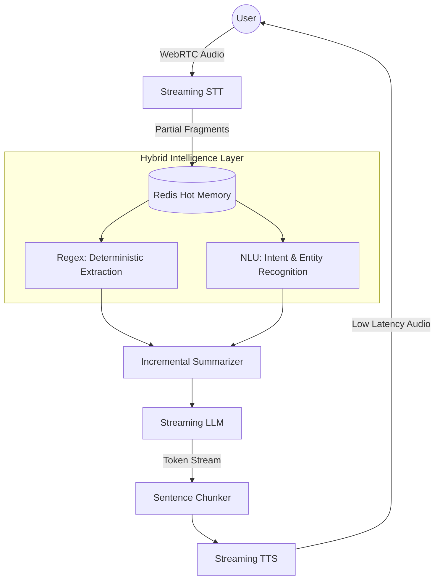

# 🎙️ High-Performance Real-Time Voice AI

### From Turn-Based Pipelines → Continuous Conversational Systems

This repository explores the architecture, trade-offs, and optimizations behind building a **low-latency, real-time Movie Recommendation Voice Agent** that behaves more like a human conversation than a turn-based system.

## 📊 Architecture Overview


---

## ❌ The Problem: The “Turn-Based” Trap

Most voice systems follow a linear pipeline:

```
STT → LLM → TTS
```

This introduces fundamental limitations:

* 🧠 **Context Loss**
  Long-form speech (30–60 seconds) can break coherence or exceed buffer limits before reaching the model.

* ⏱️ **Robotic Latency**
  Systems wait for complete transcripts, creating noticeable “dead air.”

* 🌐 **Protocol Bottlenecks**
  WebSockets (TCP) introduce head-of-line blocking, making them suboptimal for real-time audio streaming.

---

## ⚡ Core Design Principle

> **“Never wait. Always stream.”**

Human conversation is:

* Parallel (listen + think + speak simultaneously)
* Interruptible
* Context-aware in real-time

This system attempts to move closer to that behavior.

---

## 🏗️ Architecture: The Streaming Brain



---

## 🛠️ Core Optimizations & Features

### 1. 🚀 Transport Layer: WebRTC over WebSockets

**Problem:**
WebSockets are reliable but introduce jitter for real-time audio.

**Solution:**
Switched to **WebRTC (UDP-based streaming)**.

**Impact:**

* Lower latency
* Reduced jitter
* True bidirectional audio streaming

---

### 2. 🧠 Streaming Context with Redis (Hot Memory)

**Problem:**
Waiting for final transcripts delays reasoning.

**Solution:**

* Push **partial STT fragments** into Redis
* Use **incremental summarization** in the background

**Impact:**

* LLM receives context early
* Reduces perceived “thinking delay”

---

### 3. 🎯 Hybrid Intelligence Layer (NLU + Regex)

To improve responsiveness, the system separates **reflexes** from **reasoning**:

* ⚡ **Regex (Reflex Layer)**
  Instantly extracts structured data

  * Example: years (“1994”), ratings (“above 8.0”)

* 🧠 **NLU (Understanding Layer)**

  * Intent classification
  * Entity recognition (genres, actors, etc.)

**Impact:**

* Deterministic accuracy for structured inputs
* Reduced dependency on LLM for simple tasks

---

### 4. 🎧 Intelligent Barge-In (VAD Optimization)

**Solution:**

* Multi-threshold Voice Activity Detection (VAD)
* Differentiates between:

  * Backchanneling (“uh-huh”)
  * Actual interruption

**Impact:**

* Smooth user interruptions
* Reduced false triggers from noise

---

### 5. 🗣️ Sentence-Level Streaming

**Problem:**
Waiting for full responses causes 3–5s delays.

**Solution:**

* Stream LLM tokens
* Group into **sentence chunks**
* Send each sentence immediately to TTS

**Impact:**

* Near-zero perceived latency
* More natural response flow

---

## 📊 Performance Benchmarks

| Metric               | Result       |
| -------------------- | ------------ |
| First audio response | < 450ms      |
| Full-duplex latency  | ~650ms       |
| Barge-in response    | < 180ms      |
| Context recovery     | Near-instant |

---

## 🧪 Example: Hybrid Extraction

```python
import re

def process_stream(partial_text):
    # REGEX: Instant extraction of 'Year'
    year = re.search(r'\b(19|20)\d{2}\b', partial_text)
    
    # NLU: Simplified intent detection
    intent = "recommend" if "show me" in partial_text.lower() else "chat"
    
    return {
        "year": year.group(0) if year else None,
        "intent": intent
    }

# This data is continuously pushed into the LLM context
```

---

## 🚀 Getting Started

### 1. Clone the Repository

```bash
git clone https://github.com/n2coder/LumaMovieAgent
cd LumaMovieAgent
```

---

### 2. Install Dependencies

```bash
pip install -r requirements.txt
```

---

### 3. Start Redis (Context Layer)

```bash
docker run -d -p 6379:6379 redis
```

---

### 4. Run the Application

```bash
uvicorn app.main:app --reload
```

---

## 🤝 Contributing & Exploration

Currently exploring:

* Emotion-aware TTS modulation
* Vector DB (RAG) for long-term memory
* Further latency optimizations

Feel free to open issues or share ideas.

---

## 🧑‍💻 Author

**Naresh Chaudhary**
Exploring AI systems at the intersection of **real-time interaction, cognition, and system design**

---

## ⭐ Final Thought

> The future of voice AI is not faster responses.
> It’s systems that **never stop thinking while you speak.**
